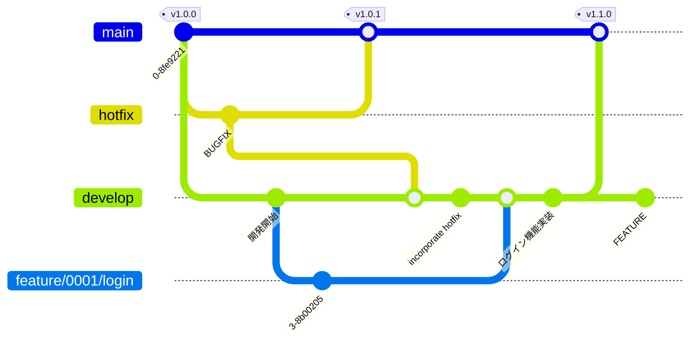

# Branch Strategy

- Git Flow をベースにしたブランチ戦略を採用
- `develop`を統合ブランチとするが，Issue規模・リリース運用の実態に合わせて，Issue用の統合ブランチを活用



## 1. ブランチの種類

### Basic Syntax

```ini
<branch-type>/<issue-number>/<task-description>
```

hotfix ブランチなど，Issue番号を含まない場合もあります．その場合は

```ini
hotfix/<task-description>
```

### 命名規則

| ブランチ種別       | 命名規則                                    | 目的                                          |
| ------------ | --------------------------------------- | ------------------------------------------- |
| **本番用**      | `main`                                  | 本番デプロイ可能な安定版コード．常にリリース済みの状態を保持              |
| **開発用**      | `develop`                               | 全機能・修正の統合先（メイン開発ブランチ）                       |
| **機能追加**     | `feature/<issue番号>/<タスク>`               | 新機能開発や改善タスク．小規模IssueはこのままdevelopへPR         |
| **機能改善**     | `enhancement/<issue番号>/<タスク>`           | 既存機能の改善タスク．UX改善・処理最適化など                     |
| **バグ修正**     | `bugfix/<issue番号>/<タスク>`                | 不具合修正用ブランチ．テスト後developへ統合                   |
| **Issue統合**  | `issue/<issue番号>`                       | **中〜大規模Issueの場合のみ**作成．複数サブタスクを統合するための統合ブランチ |
| **緊急修正**     | `hotfix/<issue番号>`                      | 本番環境向けの即時修正．修正後 main / develop 両方に反映        |
| **テスト検証用**   | `test/<issue番号>/<タスク>`                           | 一時的なテストコード・検証用ブランチ．検証完了後削除                  |
| **ドキュメント整備** | `docs/<issue番号>/<タスク>`                           | ドキュメント・ガイド・README更新などのためのブランチ               |
| **リファクタリング** | `refactor/<issue番号>/<タスク>`                       | 挙動を変えずに内部構造を改善するためのブランチ                     |
| **検証・試作用**   | `sandbox/<タスク>`                        | 新しいアイデアやPoCを試すための実験的ブランチ（非公式）．安定版にマージしない前提  |

### 命名例

| ブランチ名                             | 用途                |
| --------------------------------- | ----------------- |
| `feature/0123-add-login`             | 新機能               |
| `bugfix/0123-fix-login-error`        | 修正                |
| `issue/0123`                         | 複数サブタスクを含むIssue統合 |
| `hotfix/0145-critical-fix`           | 緊急対応              |

## 2. 開発フロー

### Step 1. サブタスク開発

各Issueに対して、必要なサブタスクごとにブランチを切ります．

```bash
git switch develop
git switch -c feature/0123/add-login
git switch -c bugfix/0123/fix-login-error
```

- 小規模Issueなら、このまま develop に直接PR(Step3へ)
- 中〜大規模Issueなら，Issue統合ブランチを作成し，サブタスクをまとめる (Step 2へ)

### Step 2. 中〜大規模Issueの統合ブランチ（任意）

複数のサブタスクをまとめてレビューしたい場合にのみ作成します．

```bash
git switch develop
git switch -c issue/0123
git merge feature/0123/add-login
git merge bugfix/0123/fix-login-error
git push -u origin issue/0123
```

- 統合PRを作成：`issue/0123` → `develop`
- チーム単位でまとめてレビュー／テストを実施

### Step 3. developへの統合

- Issue単位またはサブタスク単位で `develop` にPR作成
- ローカルで実行する場合は `git merge --no-ff` で対応

### Step 4. リリース

- `project.yml` のversion tagを修正し，`main` ブランチにPRを作成
- PRマージ時に自動でタグ付け・リリースノート作成を実施

### 運用ポイント

| 対象 | ブランチ命名規則 | 用途・対象範囲 | 運用方針 | 備考 |
|------|------------------|----------------|-----------|------|
| **小規模 Issue** | `feature/<issue番号>-<タスク>`<br>`bugfix/<issue番号>-<タスク>` | 小規模な新機能・修正 | `develop` に直接 PR | 単一タスク・軽微修正に適用 |
| **中〜大規模 Issue** | `issue/<issue番号>` | 複数サブタスクを統合 | サブタスクを統合して `develop` に PR | `feature` / `bugfix` をまとめてレビュー |

## 3. ブランチ削除ポリシー

| ブランチ種別                                | 削除タイミング          | 備考               |
| ------------------------------------- | ---------------- | ---------------- |
| `feature` / `bugfix` / `issue`          | develop マージ後     | 即削除（必要ならタグで履歴追跡） |

## 4. 注意事項

### Rule 1: 小文字とハイフンを使用する

- ブランチ名は常に小文字で記述
- 大文字を含めると，ファイルシステムが大文字・小文字を区別する環境がある
- 単語の区切りにはハイフン（`-`）を使用

**📘 Example**

- ✅ Good: `feature/user-login`
- ❌ Avoid: `Feature_UserLogin`, `FeatUserLogin`

### Rule 2: 明確なトークンからブランチ名を開始する

- 各ブランチ名は、目的を示すカテゴリトークンから始めます。
- トークンの例：
  - `feature`（新機能開発）
  - `bugfix`（バグ修正）
  - `docs`（ドキュメント更新）
- トークンと説明文はスラッシュ（`/`）で区切る

**📘 Example**

- ✅ Example: `bugfix/payment-timeout`
- ❌ Avoid: `payment-timeout` (purpose unclear)

**活用例**

```bash
# Listing branches by token
$ git branch --list "feature/*"

# Pushing or mapping branches with tokens
$ git push origin 'refs/heads/feature/*'

# Deleting multiple branches by token
$ git branch -D $(git branch --list "feature/*")
```

### Rule 3: ブランチ名は簡潔・明確に

- 意図を説明できる範囲で，長すぎる名前は避ける
- 長すぎるブランチ名は，ログ表示の一行に収まらず，可視性が下がるため

**📘 Example**

- ✅ 良い例: `refactor/api-headers`
- ❌ 悪い例: `refactor/update-the-way-we-handle-request-headers-in-api`

### Rule 4: 衝突を生む可能性のあるブランチは作らない

- `git switch -c feature` のように意図が不明瞭な名前や既存ブランチと衝突する可能性のある名前は避ける
- Gitは内部的に ブランチ名をパス（ディレクトリ構造）として管理しているため，`feature` が作成されていると `feature/login-v2` が名前衝突して作成できなくなってしまう
  - 同じ階層にファイルとディレクトリを同時に作れないため

**📘 Example**

```bash
$ git switch -c bugfix/0123/fix-login-error
Switched to a new branch 'bugfix/0123/fix-login-error'

$ ls .git/refs/heads/bugfix/0123
fix-login-error
```
